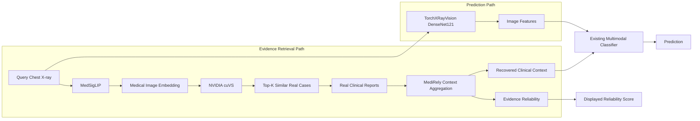

# MediRely

**Reliable Clinical Context Recovery**

> **Retrieve, Don't Hallucinate. Recover, But Verify.**

MediRely helps multimodal medical AI remain reliable when clinical reports are
unavailable by **retrieving real clinical evidence, recovering useful context, and
estimating whether that evidence is trustworthy** — instead of hallucinating a
missing report.

> ⚕️ **Research prototype — not for clinical use.** See [Disclaimer](#clinical-disclaimer).

---

## Demo

<!-- TODO: replace with the final demo video / GIF -->
> 📹 **Demo video:** _add link here_ &nbsp;·&nbsp; place a GIF at `assets/demo.gif` and embed it:
> ``

What you see in the demo:

1. A chest X-ray is loaded — **CHEST X-RAY: AVAILABLE**.
2. The clinical report is **MISSING**.
3. Click **Recover with MediRely**.
4. MedSigLIP encodes the X-ray; **NVIDIA cuVS** retrieves the Top-K most similar
   real cases from the clinical memory.
5. The retrieved cases are shown with **similarity scores** and **real report excerpts**.
6. MediRely aggregates those reports into **recovered clinical context**.
7. An **Evidence Reliability** score (HIGH / MEDIUM / LOW) estimates how much the
   recovered context can be trusted.
8. The **image-only** prediction is compared with the **MediRely** prediction.

---

## What it does

When a clinical report is unavailable, MediRely:

1. encodes the X-ray with **MedSigLIP** (retrieval representation),
2. retrieves similar **real** cases using **NVIDIA cuVS** (GPU vector search),
3. aggregates their **real reports** into recovered clinical context,
4. estimates **evidence reliability**,
5. supports the downstream multimodal prediction — whose image encoder remains the
   validated **TorchXRayVision DenseNet‑121**.

> **MedSigLIP is used only for the evidence-retrieval branch.** It does **not**
> perform the final prediction. MediRely **retrieves and aggregates real report
> evidence — it is not a report-generation model.**

---

## Results

Held-out **IU X-Ray** test set, macro AUC (**GTC retrieval extension**):

| Method | Macro AUC |
|---|---:|
| Image only | 0.722 |
| XRV retrieval | 0.777 |
| **MedSigLIP + NVIDIA cuVS retrieval** | **0.819** |

See [Results](#results-1) for the full breakdown and the separately-labelled
GTC-only calibrated (soft-gated) variant. These are **not** the original MICCAI
paper numbers — see [Research foundation](#research-foundation).

---

## Quick Start

The demo runs in two configurations. **Genuine NVIDIA cuVS runs in the WSL2
(Ubuntu) backend**; Windows-native uses a PyTorch CUDA fallback (never labelled as
cuVS). Choose your path:

### WSL2 — genuine NVIDIA cuVS (recommended)

```bash
# 1) clone
git clone <repo-url> medirely && cd medirely

# 2) environment (Ubuntu / WSL2, NVIDIA driver with CUDA 12 support)
conda create -n medirely_live python=3.11 -y && conda activate medirely_live
pip install torch==2.8.* torchvision==0.23.* --index-url https://download.pytorch.org/whl/cu129
pip install --extra-index-url https://pypi.nvidia.com cuvs-cu12==24.12.*
pip install -r requirements-wsl-cuvs.txt

# 3) place the model + artifacts (see "Model setup" and "Artifact setup")
#    ./medsiglip-448/            (MedSigLIP snapshot, gated on Hugging Face)
#    ./artifacts_local/          (embeddings, checkpoint, bank, calibration, images)

# 4) run — header shows "NVIDIA cuVS / LIVE"
export MEDIRELY_MODEL_ROOT="$PWD"
./run_local_cuvs.sh
```
Then open **http://localhost:7860** in your Windows browser.

### CPU-only UI preview (no GPU, no model — instant)

```bash
pip install -r requirements-wsl-cuvs.txt      # only the light web stack is used
python -m gtc_demo.app.app --preview
```
Preview renders the interface from **recorded** verified outputs for the built-in
demo cases (it does **not** run live inference and never claims live cuVS).

### Windows-native fallback (PyTorch CUDA)

```bat
run_local_gpu.bat
```
Header shows **PyTorch CUDA / LIVE**. See [Windows fallback](#windows-fallback).

---

## Why MediRely

Many multimodal medical AI models assume that **both** the image **and** the
clinical report are available at inference time. In real workflows the report may
be **missing, delayed, inaccessible, or simply not yet written**.

Two common fallbacks are unsatisfying:

- **Image-only inference** discards the text modality the model was trained to use,
  which can reduce confidence or predictive performance.
- **Generating a missing report** risks introducing **hallucinated** clinical
  context that was never grounded in real evidence.

**MediRely instead retrieves real evidence from similar cases and explicitly
estimates whether that evidence is trustworthy** — recovering context without
inventing it, and telling the user how much to trust the recovery.

---

## Key features

- **Missing-context recovery** — keeps the multimodal pipeline working when the report is absent
- **Real clinical evidence retrieval** — Top-K real training cases, not generated text
- **MedSigLIP medical image embeddings** for the retrieval representation
- **NVIDIA cuVS** GPU vector search over the clinical memory
- **Reliability-aware** context recovery (evidence agreement + retrieval confidence)
- **Existing multimodal prediction branch preserved** (TorchXRayVision DenseNet‑121)
- **Local GPU demo** on a consumer NVIDIA GPU
- **Interactive Gradio interface** with an honest, live backend badge

---

## System architecture



**Evidence Retrieval Path** = MedSigLIP + NVIDIA cuVS. **Prediction Path** = the
validated TorchXRayVision DenseNet‑121 encoder + the existing multimodal
classifier. Evidence Reliability is **displayed** to the user; it is not fed into
the classifier. (An optional, clearly-labelled *GTC-only calibrated soft-gate*
blends image-only and recovered-context probabilities — see [Results](#results-1).)

---

## How it works

**Step 1 — Query X-ray input.** A chest X-ray enters the pipeline; the clinical
report is absent.

**Step 2 — MedSigLIP retrieval representation.** The X-ray is encoded into a
medical image embedding (1152-d) with `google/medsiglip-448` using its official
`SiglipImageProcessor` preprocessing (448×448). This embedding is used **only for
retrieval**.

**Step 3 — NVIDIA cuVS search.** cuVS performs GPU nearest-neighbour search over
the clinical memory (the MedSigLIP embeddings of the training cases) and returns
the Top-K nearest cases. Cosine similarity is computed via squared-Euclidean on
L2-normalized vectors (`cosine = 1 − d/2`).

**Step 4 — Real report evidence.** The **real** reports of the retrieved cases are
used as evidence (surfaced in the UI as report excerpts and similarity scores).

**Step 5 — Context recovery.** MediRely aggregates the retrieved report evidence
(similarity-weighted) into a recovered clinical-context representation. No text is
generated.

**Step 6 — Reliability estimation.** Neighbour **evidence agreement** and
**retrieval confidence** are combined by a validation-calibrated gate into an
evidence-reliability estimate (HIGH / MEDIUM / LOW).

**Step 7 — Prediction.** TorchXRayVision DenseNet‑121 extracts the image
representation used by the validated prediction branch. That image representation
and the recovered clinical context are fed into the **existing multimodal
classifier** to produce the prediction.

---

## NVIDIA technology

**NVIDIA cuVS** powers the **GPU clinical-memory retrieval** in MediRely:

- Top-K nearest-neighbour search over the MedSigLIP clinical-memory embeddings.
- Genuine cuVS brute-force (`from cuvs.neighbors import brute_force`) on a local
  NVIDIA GPU (run inside the WSL2 backend).
- The GUI shows the **actual** retrieval backend (`NVIDIA cuVS / LIVE`); if cuVS is
  unavailable, the app refuses to mislabel it (see [Verifying cuVS](#verifying-nvidia-cuvs-is-active)).

> The clinical memory in this demo has ~5,217 vectors. **We do not claim a speedup
> over PyTorch at this size** — cuVS is used as the genuine, scalable GPU
> nearest-neighbour backend for the retrieval layer. cuVS-vs-PyTorch **numerical
> parity** is reported in [Reproducibility](#reproducibility).

---

## Open models and dependencies

| Component | Role |
|---|---|
| **MedSigLIP** (`google/medsiglip-448`) | Evidence **retrieval** representation (image embedding) |
| **TorchXRayVision DenseNet‑121** | **Prediction** image encoder (validated branch) |
| **NVIDIA cuVS** | GPU nearest-neighbour retrieval over the clinical memory |
| **Gradio** | Interactive demo interface |

MedSigLIP does **not** produce the final prediction; it only drives retrieval.

---

## Results

All numbers below are the **GTC retrieval extension** on the **held-out IU X-Ray
test set** (macro AUC). They are **separate from** the original MICCAI research
results (see [Research foundation](#research-foundation)).

**Retrieval representation comparison** (same validated classifier, same test set):

| Method | Macro AUC |
|---|---:|
| Image only | 0.722 |
| XRV retrieval | 0.777 |
| **MedSigLIP + NVIDIA cuVS retrieval** | **0.819** |

**GTC-only calibrated extension (soft-gated)** — a validation-calibrated blend of
the image-only and recovered-context predictions. Reported **separately** because
it is an added GTC-only calibration, not the base recovery result:

| Method (GTC-only calibrated) | Macro AUC | ECE |
|---|---:|---:|
| MedSigLIP + cuVS, soft-gated | 0.824 | 0.015 |

> Do not mix these numbers with the original MICCAI paper. The MICCAI research
> established the missing-context recovery framework; the MedSigLIP/cuVS numbers
> here are the GTC extension.

---

## Demo examples

The interface ships three explanatory built-in cases (image-only → MediRely on the
headline finding):

| Example | Type | Image-only → MediRely | Evidence reliability |
|---|---|---|---|
| **Strong recovery** | coherent evidence | No Finding **4% → 96%** | HIGH |
| **Ambiguous / conflicting** | atelectasis, neighbours disagree | Atelectasis **46% → 68%** | MEDIUM |
| **External X-ray (demo)** | cardiomegaly, user-provided image | **82% → 98%** | — |

- **Strong recovery**: retrieved neighbours are consistently normal; recovered
  context strengthens the prediction with high reliability.
- **Ambiguous / conflicting**: retrieved neighbours disagree, so MediRely reports
  **lower** reliability — it does not blindly trust the recovered context.
- **External X-ray (demo example only)**: an out-of-dataset image used to
  illustrate the workflow. This is a **demonstration example, not benchmark
  evidence**; the model prediction may be described as *consistent* with the image
  source, but this is **not** formal clinical ground-truth validation.

---

## Performance and latency

Measured **local demo** end-to-end inference times on the maintainer's demo
hardware — **NVIDIA GeForce RTX 2060, 6 GB VRAM** (WSL2 backend):

| Run | End-to-end (ms) |
|---|---:|
| 1 | 670.8 |
| 2 | 640.4 |
| 3 | 596.7 |

The **first** inference after launch is slower (model + CUDA-kernel warm-up) and is
**not** representative inference latency; subsequent runs are faster. These numbers
are specific to the RTX 2060 6 GB demo machine and **should not be generalized** to
other GPUs.

---

## Local installation

### Prerequisites

- An NVIDIA GPU and a **recent NVIDIA driver**.
- For genuine cuVS: **WSL2 (Ubuntu)** — NVIDIA cuVS / RAPIDS provide Linux/WSL2
  wheels only; there is **no native-Windows cuVS**. Your Windows driver must
  support **CUDA 12** for the WSL2 backend.
- **Conda / Miniconda** and **Git**.

### Tested environment (maintainer's WSL2 setup)

> Reported by the maintainer's working machine. Versions are pinned in
> `requirements-wsl-cuvs.txt`.

| Component | Version |
|---|---|
| Host | Windows 11 |
| Backend | WSL2 Ubuntu 24.04 |
| GPU | NVIDIA GeForce RTX 2060, 6 GB |
| Python | 3.11 |
| PyTorch | 2.8.0 + CUDA 12.9 |
| torchvision | 0.23.0 |
| transformers | 4.45.2 |
| NVIDIA cuVS | 24.12 |
| Gradio | 4.44.1 |
| gradio_client | 1.3.0 |
| fastapi | 0.112.2 |
| starlette | 0.38.6 |
| pydantic | 2.9.2 |
| huggingface_hub | 0.25.2 |

### Step-by-step (WSL2, genuine cuVS)

```bash
git clone <repo-url> medirely
cd medirely

conda create -n medirely_live python=3.11 -y
conda activate medirely_live

# CUDA-12 PyTorch (match your driver; cu129 wheels used on the tested machine)
pip install torch==2.8.* torchvision==0.23.* --index-url https://download.pytorch.org/whl/cu129

# genuine NVIDIA cuVS (Linux/WSL2 wheel from NVIDIA's index)
pip install --extra-index-url https://pypi.nvidia.com cuvs-cu12==24.12.*

# application dependencies (pinned)
pip install -r requirements-wsl-cuvs.txt
```

### Model setup — MedSigLIP

MediRely uses `google/medsiglip-448`. This model is **gated** on Hugging Face and
may require accepting the Health AI Developer Foundations (HAI-DEF) terms on the
model page before download.

- Download the snapshot and place it at **`./medsiglip-448/`** (so that
  `./medsiglip-448/config.json` exists), **or** set an environment variable:
  - `MEDIRELY_MODEL_ROOT=/path/to/parent` → expects `/path/to/parent/medsiglip-448`, or
  - `MEDIRELY_MEDSIGLIP_DIR=/path/to/medsiglip-448` (used by scripts).
- **Do not commit** the weights or any Hugging Face token. `.gitignore` already
  excludes `medsiglip-448/` and `*.safetensors`.

### Artifact / clinical-memory setup

The demo consumes pre-generated artifacts. The **researcher-generated, audited-safe**
ones now ship in **`public_artifacts/`** (see
[`public_artifacts/ARTIFACTS.md`](public_artifacts/ARTIFACTS.md) for the full manifest,
SHA256 checksums, and sanitization details). Gated weights and source imagery are
**not** redistributed and must be obtained from their official sources.

Status legend: **Included** (ships in this repo) · **Public generated** (researcher-made,
in `public_artifacts/`) · **User-provided** (you supply local paths) · **Official source**
(obtain from a gated/licensed provider) · **Optional**.

| File | Status | How to obtain / generate |
|---|---|---|
| `configs/iu_xray_xrv.yaml` | ✅ Included | ships in `configs/` |
| `best_iu_full_image_text_xrv.pth` | 🟢 Public generated | in `public_artifacts/` (classifier weights + `text_vocab`; weights unchanged, verified) |
| `medsiglip_train_embeddings.npz` | 🟢 Public generated | in `public_artifacts/` (MedSigLIP embeddings of the 5217 train images; **paths/IDs removed**, values identical) |
| `iu_train_memory_bank_public.pt` | 🟢 Public generated | in `public_artifacts/` (sanitized XRV bank: embeddings+labels only; report text/paths removed) |
| `step4_medsiglip_comparison.json` | 🟢 Public generated | in `public_artifacts/` (AUC + reliability-gate calibration; metrics unchanged) |
| `medsiglip-448/` weights | 🔒 Official source | **gated** — download from https://huggingface.co/google/medsiglip-448 (accept license); place at `./medsiglip-448/` or set `MEDIRELY_MEDSIGLIP_DIR`. **Not redistributed here.** |
| IU X-Ray images (`bank_images/`, `demo_images/`) | 🔒 Official source | obtain from Open-i / Indiana University: https://openi.nlm.nih.gov/ ; then run `python scripts/prepare_local_iu_assets.py`. **Not redistributed here.** |
| `iu_train_memory_bank_xrv.pt` (full, w/ report text) | 🟡 User-provided (optional) | your local private bank; enables real report snippets in the GUI. The public sanitized bank above is a drop-in with identical numbers. |
| `gallery_sources.json` | 🟡 User-provided | copy `configs/gallery_sources.example.json` → `gtc_demo/artifacts/gallery_sources.json` and point `image_path`s at your local IU PNGs |

**Reproducibility note.** With only the four `public_artifacts/` files + the gated
MedSigLIP weights + your own copy of the IU images, the live cuVS pipeline reproduces
the reported numbers exactly (retrieval/reliability/prediction are numerically
identical whether you use the private or the public bank — the sanitized artifacts
preserve every value used at inference). Report **text snippets** in the GUI require
the private full bank; they are display-only and never affect predictions, and are
**not** fabricated for the public bank.

The **IU (Indiana University) Chest X-Ray** dataset is de-identified (U.S. National
Library of Medicine Open-i) but is **not** redistributed here. **Do not commit patient
data or absolute local paths** — all paths are configurable via the environment
variables above.

Fetch + verify the public artifacts (from a GitHub Release or your own Google Drive
links) with:

```bash
python scripts/download_public_artifacts.py --base-url <release-or-drive-base-url>
# checks each file's SHA256 against public_artifacts/ARTIFACTS.md; never fetches gated weights/data
```

> `.gitignore` publishes only `public_artifacts/` and excludes everything else
> sensitive (`medsiglip-448/`, `*.safetensors`, the private `*.pth`/`*.pt`/`*.npz`
> outside `public_artifacts/`, `bank_images/`, `demo_images/`, `data/`, `outputs/`,
> real `gallery_sources.json`). The repository ships **code + docs + audited public
> artifacts + recorded preview assets**.

---

## Running the demo

Primary (WSL2, genuine cuVS):

```bash
export MEDIRELY_MODEL_ROOT="$PWD"     # if ./medsiglip-448 is in the repo root
./run_local_cuvs.sh
```

- The inference backend runs inside **WSL2**; open the app from your **Windows
  browser** at **http://localhost:7860**.
- The **first** inference is slower (models + CUDA kernels warming up). Subsequent
  runs are faster — do not treat the first-run time as steady-state latency.
- `run_local_cuvs.sh` sets `MEDIRELY_RETRIEVAL_BACKEND=cuvs` (**strict**): if
  genuine cuVS cannot import/build, the app **aborts with a clear error** rather
  than silently falling back to PyTorch.

---

## Verifying NVIDIA cuVS is active

At startup the app prints a readiness report; in cuVS mode it includes:

```
[OK] RTX 2060 / CUDA GPU visible
[OK] MedSigLIP encoder + bank
[OK] XRV model + classifier
[OK] reliability calibration
[OK] demo cases
[OK] genuine NVIDIA cuVS (import + index build)
  retrieval backend = 'cuvs' → shown as 'NVIDIA cuVS'
```

In the GUI, the header/deployment badge shows **`NVIDIA cuVS`** and a **`LIVE`**
status. You can also confirm end-to-end that cuVS and PyTorch produce identical
results on your GPU:

```bash
python -m gtc_demo.scripts.local_cuvs_parity     # writes gtc_demo/artifacts/local_cuvs_end_to_end_parity.json
```

If cuVS is not genuinely available, this script and the strict launcher **fail
clearly** — the demo never labels a fallback as cuVS.

---

## Windows fallback

Native Windows has **no cuVS**. A separate PyTorch CUDA fallback is provided:

| Configuration | Retrieval backend | GUI badge |
|---|---|---|
| **WSL2 backend** | genuine **NVIDIA cuVS** | `NVIDIA cuVS / LIVE` |
| **Windows-native fallback** | **PyTorch CUDA** exact search | `PyTorch CUDA / LIVE` |

```bat
run_local_gpu.bat
```

This runs `MEDIRELY_RETRIEVAL_BACKEND` in `auto`/`torch` mode. The MedSigLIP
embedding + the full MediRely pipeline are identical; only the nearest-neighbour
**search implementation** differs. The Windows-native fallback is **never** labelled
as cuVS.

---

## Repository structure

```
medirely/
├── gtc_demo/                     # the GTC demo application package
│   ├── app/                      # Gradio app, components, styles, adapters, config
│   │   ├── app.py                #   entry point (python -m gtc_demo.app.app)
│   │   ├── components.py         #   HTML builders (header, evidence, reliability, ...)
│   │   ├── styles.css            #   dark radiology-workstation theme
│   │   ├── local_config.py       #   env-configurable artifact/model paths
│   │   └── gallery.json          #   the 3 demo cases (labels + explanations)
│   ├── pipeline/
│   │   └── medirely_gtc.py       # orchestrator: retrieval swap + validated classifier
│   ├── models/
│   │   └── medsiglip_encoder.py  # frozen MedSigLIP image-tower encoder
│   ├── retrieval/                # backend abstraction
│   │   ├── cuvs_index.py         #   genuine NVIDIA cuVS (brute_force) + fallbacks
│   │   └── torch_retriever.py    #   PyTorch CUDA exact search
│   ├── scripts/                  # parity / self-test utilities
│   │   ├── local_cuvs_parity.py  #   end-to-end cuVS-vs-torch parity
│   │   └── benchmark_retrieval_parity.py
│   ├── demo_assets/              # recorded outputs for CPU --preview (de-identified)
│   └── artifacts/cuvs_parity.json# retrieval parity metrics (no data)
├── utils/                        # validated research utilities (io, retrieval, transforms, ...)
├── models/                       # validated research model code (classifier, encoders, bank)
├── configs/iu_xray_xrv.yaml      # model + retrieval configuration (paths are placeholders)
├── run_local_cuvs.sh             # WSL2 launcher (genuine cuVS, strict)
├── run_local_gpu.bat             # Windows-native launcher (PyTorch CUDA fallback)
├── requirements-wsl-cuvs.txt     # WSL2 cuVS environment (pinned)
├── requirements-local-gpu.txt    # Windows-native fallback environment
└── README.md
```

Gitignored (obtain/generate locally): `medsiglip-448/`, `artifacts_local/`,
`bank_images/`, `demo_images/`, `*.pth`, `*.pt`, `*.npz`, `data/`, `outputs/`.

---

## Reproducibility

- **Retrieval encoder:** `google/medsiglip-448`
  - Model revision: `9cea28a1a1195f665105faa6e8544c112fd960a4`
  - Preprocessing: official `SiglipImageProcessor` — 448×448, bicubic, rescale
    1/255, mean/std = 0.5; grayscale X-ray replicated to 3 channels; frozen image
    tower via `get_image_features` (embedding dim **1152**, float32).
- **Prediction encoder:** TorchXRayVision DenseNet‑121 (`densenet121-res224-all`),
  224×224, ImageNet normalization, grayscale→3 channels.
- **Top-K:** default **10** (`configs/iu_xray_xrv.yaml → retrieval.topk`).
- **Retrieval math:** L2-normalized vectors, squared-Euclidean, `cosine = 1 − d/2`;
  row order and row IDs of the memory bank are preserved exactly across backends.
- **cuVS vs PyTorch parity (verified):** on the maintainer's RTX 2060, Top-1 /
  Top-K set / ordered / Jaccard agreement = **100%** with max similarity difference
  ~`1e-6`. End-to-end (retrieval → reliability → prediction) parity is reproducible
  with `python -m gtc_demo.scripts.local_cuvs_parity`.
- **Hardware for demo latency:** NVIDIA GeForce RTX 2060, 6 GB (WSL2 Ubuntu 24.04).

---

## Research foundation

The original **MediRely** research established the **missing-context recovery
framework** and was accepted at the **MICCAI 2026 ML-CDS Workshop**.

> The original MediRely research established the missing-context recovery
> framework. This GTC demo **extends** the system with an interactive application,
> **MedSigLIP-based evidence retrieval**, and **NVIDIA cuVS** integration.

The MedSigLIP + NVIDIA cuVS results in this repository are the **GTC extension** and
are **not** the original MICCAI paper results.

---

## Clinical disclaimer

**Research prototype — not for clinical use.** MediRely is intended for research
and demonstration only. It is **not** a medical device, not a diagnostic tool, and
not a clinical decision-support system. It must not be used for patient care or any
real clinical decision-making.

---

## Citation

<!-- TODO: replace with the final publication metadata when available -->
```bibtex
@inproceedings{medirely2026,
  title     = {MediRely: Reliability-Aware Recovery for Missing Clinical Context in Multimodal Medical AI},
  author    = {<authors>},
  booktitle = {MICCAI 2026 ML-CDS Workshop},
  year      = {2026},
  note      = {GTC demo extension: MedSigLIP evidence retrieval + NVIDIA cuVS}
}
```

---

## Acknowledgments

- **NVIDIA cuVS** — GPU nearest-neighbour retrieval backend.
- **MedSigLIP** (`google/medsiglip-448`) — medical image–text representation.
- **TorchXRayVision** — DenseNet‑121 chest X-ray encoder.
- **Gradio** — interactive demo framework.
- The **IU (Indiana University) Chest X-Ray** dataset (NLM Open-i).

---

## License

No license file is currently present in this repository. **Please add a `LICENSE`
before making the repository public** (e.g. MIT / Apache-2.0 for the code), and note
that model and dataset licenses (MedSigLIP / HAI-DEF terms, IU X-Ray terms) apply to
their respective artifacts and are **not** granted by this repository.
